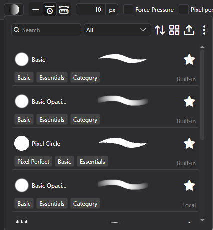
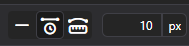
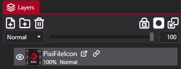
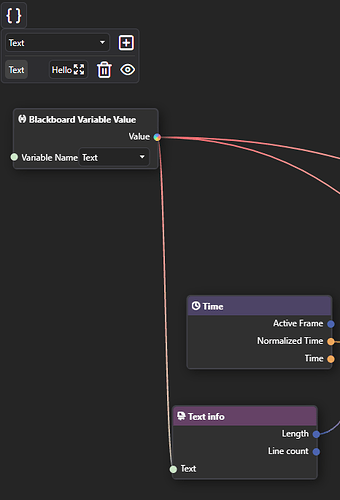
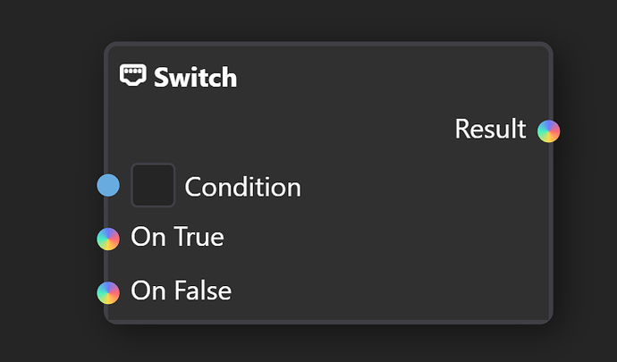

After months of work, I can finally show you exciting changes and new features. Long awaited Node Based Brush Engine is here, along with Smart Layers, Blackboard system, new Renderer and much more!


This is a **development** release, which means it may be buggy, there are lacking features and there is a risk, that files made in dev versions will not work as expected in next stable releases.

To test it out, follow https://pixieditor.net/docs/open-beta/

## Brush Engine



Likely, the most awaited of features, you can now create your own Brushes with PixiEditor's Node Graph!

At the moment, there are 6 built-in brushes, that you can test and use as a template for creating your own.

Use new Brush Picker within Pen Tool to select, duplicate and edit brushes.

**Brushes behave differently in Pixel Art and Painting toolset. Antialiasing is not automatically applied in Pixel Art toolset. However some Brushes are custom and may still apply it.**

### Small how-to guide

Check out [this forum post](https://forum.pixieditor.net/t/pixieditor-2-1-0-0-dev-is-here/511#p-978-small-how-to-guide-before-i-write-proper-docs-4) for a quick start guide on how to create your own brushes.

### Precise paint engine

PixiEditor now uses precise paint engine. Previously all brush stamps were rounded to pixels, starting from version 2.1, you can paint with sub-pixel precision. Snapped pixels are still an option per-brush.

### Stabilizers



We've added 2 stabilizers: Distance based and Time based. They are available within pen tool settings in the viewport. 

**Time based**: Stabilization is calculated based on time passed between previous position and new position.

**Distance based**: You need to move X pixels before brush follows your pointer. It's like dragging something with a rope, you need to move far enough for the rope to become tight, before it draggs the thing on the other side.

## Smart Layers



PixiEditor now support smart layers. You can use other .pixi files within your document, embed .svg files directly as layers and more.

PixiEditor's advanced Node Graph allows to expose values to parent document, if they are embedded as a nested document (smart layer). Additionally, with new Blackboard feature, you can define inputs to your smart layers. 

So for example you can create a nice text animation template and create "Text" blackboard input.
Then after embedding this animation within other file, you can type your text and it will be passed to the nested document.



This way you can reuse one file multiple times and compose your graphics/animations much more easily.

## Blackboard 

Blackboard is our solution for multiple, important things:


- It serves as a way to define and reuse constants within one Node Graph
- It defines Brush settings, that are exposed in Pen tool settings when brush is picked
- It allows for defining inputs for graphs. Inputs are a gateway to pass data between parent document and embedded one. If you prefer programming comparision, you can think of a nested graph as a function and inputs as function parameters.

## New Renderer

As a response to a few important issues, I've decided to rewrite a lot of core rendering components. There are plenty of new optimizations and characteristics. A few issues, that the new renderer is trying to solve:

- Bad/inaccurate previews
- Bad performance when running some animations
- Better responsiveness of the app

The core idea behind new renderer is to decouple UI controls from actual graph rendering. I am aiming to make it truly asynchronous on a separate thread, but it's a very challenging problem, so at the moment, rendering is pseudoasynchronous. It means, that rendering is still running on the main thread, but it's scheduled on background priority when possible.

Please report any issues rendering. If you're interested about this topic in more depth, check out [November Status](http://localhost:4321/blog/2025/10/02/september-status#new-renderer) post.

## New Nodes

- Gradient Node: Create gradients procedurally
- Pattern Node: Draw vector stroke out of input image.
- Viewport Info: Information about active viewport
- Blackboard Variable Value: Access blackboard variables
- Stroke Info: Info about current Brush stroke, only works within Brushes
- Brush Output: A node for defining brushes, see Brush Engine section
- Pixel Perfect Ellipse: New shape, that creates pixel-perfect ellipses
- Switch: Choose a value based on a condition
- Equals: Are two items equal
- Expose Value: Exposes arbitrary value from the graph as a output, when nested into other document.
- Editor Info: Info about current editor state, currently only Primary and Secondary color
- Nested Document: Smart Layer node. Allows for picking any document file.
- Pointer Info: Info about current pointer, such as pressure, position on canvas and more.
- Keyboard Info: Information about keyboard state, currently bools about modifier keys.

## New Sockets

You may notice new colorful inputs in the graph, they mean that any type can be plugged into them. 



## Customizable Toolsets and Brush Tools

You can now create your own toolsets and tools based on Brushes.

Go to `%localappdata/PixiEditor/Configs` and create a file called `ToolSetsConfig.json`. Now, the contents of the file may look like this:

```json
{
  "CustomTools": [
    {
      "ToolName": "Gradient",
      "Brush": "path/to/brush/GradientBrush.pixi",
      "Icon": "path/to/icon.png",
      "ToolTip": "Allows for drawing gradients",
      "DefaultShortcut": "G",
      "ActionDisplays": [
        {
          "ActionDisplay": "Click and drag to create a gradient"
        },
        {
          "Modifiers": "Ctrl",
          "ActionDisplay": "Click and drag to create an inverted gradient."
        }
      ]
    }
  ],
  "ToolSets": [
    {
      "Name": "Toolset",
      "Icon": "icon-noise",
      "Tools": [
        "Gradient"
      ]
    },
    {
      "Name": "PAINT_TOOLSET",
      "Icon": "icon-paint-brush",
      "Tools": [
        {
          "ToolName": "MoveViewport",
          "Icon": "path/to/new/icon.png"
        }
      ]
    }
  ]
}
```

For icons, you can use .png, .svg or `icon-name` to use PixiEditor's built-in icons. All glyphs can be found [here](https://github.com/PixiEditor/PixiEditor/blob/master/src/PixiEditor.UI.Common/Fonts/PixiPerfectIcons.axaml).

You can overwrite built-in toolsets settings and icons. It is not possible to remove any existing items.

## Other enchancements

- Importing images now embed them as smart layers by default. To edit them, you need to rasterize them.
- Improved string editor. Now it supports syntax highlighting for shaders, search and replace and more.
- Improved stability of OpenGL render api
- Clipboard now should work much better and more stable. Linux bros, please test!

## Known Issues

- Performance on OpenGL (Windows, MacOS) is noticeably worse than Vulkan on Windows.
- Performance on Vulkan for Linux is worse than OpenGL for Linux (bruh)

Some Brushes suffer from this greatly, I'm working on improving it, but for now, make sure to use Render api which works better on your machine (sorry MacOS!)
- Equals node does not support contextful inputs yet.

For feedback, check out [Brush Engine Mega Thread](https://forum.pixieditor.net/t/brush-engine-mega-thread/510?u=flabbet) and our [Discord Server](https://discord.gg/qSRMYmq)