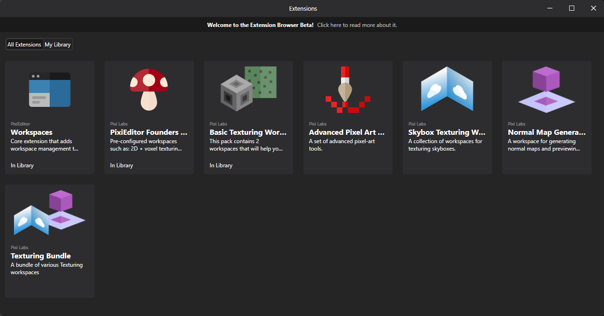

It was another busy month at PixiEditor HQ. We've been gluing everything together and managed to craft the first Release Candidate of version 2.1!

You can test it today on [Development Channel](https://pixieditor.net/docs/open-beta/)

_release candidate is a version that is feature complete, somewhat stable, and intended for final testing_

The rest of the blog post is about changes made in the last month, if you're looking for a list of features in version 2.1, check [my previous entry](https://pixieditor.net/blog/2025/12/10/21-beta/).

## Extension Browser

PixiEditor is aiming to be a go-to tool for any 2D creation and editing. This is an incredibly ambitious and challenging goal. We believe that one of the things that is crucial for this is letting the community build and extend PixiEditor.



And this is what Extension Browser is for. We have divided its development into a few phases.

### Phase 1 - Early Beta. We are here

The goal of Phase 1 is to test our extension backend and see how everything is working together, and fund the development of the next phases with paid extensions.

At this point, extensions SDK and ABI are in the alpha - far from being complete and not really open for developers, but enough for us to test it in the field more broadly.

In Phase 1, the extension browser will only contain extensions made by us (you’ll see PixiEditor and Pixi Labs in the Developer section). In other words, it’s not open for public extensions yet.

Throughout phase 1, we’ll be adding free and paid extensions. It’s a part of our project funding strategy.

### Phase 2 - First public extensions

To even begin with Phase 2 at the capacity we have planned, we need to gather enough funding from extensions on Phase 1. Extensions are one of the biggest architectural challenges for the project and need stable funding.

In phase 2, the extensions SDK and ABI should be stable and provide a minimum set of interactions with PixiEditor. This includes things like an ability to create custom file parsers, accessing and editing the Node Graph, manipulating the layer tree, and drawing capabilities.

This is a moment where we can open an extension browser for other developers, likely to a limited and selected group of people.

At this point, we’ll test the developer portal for creating and publishing extensions.

### Phase 3 - Open Extension Directory

Party day! Everyone will have access to the developer portal and will be able to publish their own extensions.

### What about Steam? Are extensions available there, too?

Steam is great, we all love Gaben. However, there is a major problem. PixiEditor for Steam has a completely separate authentication and “account” system from the standalone one.

And for a good reason, Steam's policy disallows selling outside of their shop. We even had to remove the “Donate” button (that was opening PixiEditor’s Open Collective page) from the app.

Also, this is why Founder’s Pack bought on PixiEditor’s website is not available on Steam and vice versa.

For Phases 1 & 2, we’ll likely not introduce Extension Browser for the Steam version. We’re considering using Steam Workshop for the Steam version, but it brings another set of problems we need to consider.

## Small curiosities related to extensions

### Video player

There is no built-in video player in Avalonia UI. They offer Media Player in their paid controls pack, but I wanted to stick to FOSS solutions. I was looking around to find something suitable and stumbled upon https://github.com/videolan/libvlcsharp.
Turns out, people who are responsible for VLC Media Player simply gave the world their libVLC that contains most of the VLC features, and I can just embed it, fucking legends.

For the extension browser use case, it's a bit too heavy though, I don't need most features of it, not even audio streaming, so ~100MB more would not be justifiable.

But then I got the idea, we already have FFMpeg bundled for animation rendering, so maybe I can just use it. I didn't want to include FFProbe, so after hacking around a little, I managed to build a simple video player
with ffmpeg only. 

<video src="/videos/2.1-rc1/ext.webm" loop autoplay mute controls playsinline width={700}/>

Seems to be good enough for the use case.

### Rust SDK

PixiEditor's extension system is based on WASI modules, so technically it is not limited to any programming language. To keep things consistent, I was developing and using the C# SDK for our extensions, and the Founder's Pack was built with C#.
It's great, but has one major flaw... extension size. The smallest extension is about 10 MB uncompressed. This might be a big problem for loading times.

A lot of WASI tooling is made with Rust, and Rust in general supports it very well, so I wanted to play around and see how much work it would need to make a Hello World extension for PixiEditor with it.

It was surprisingly simple, even considering my Rust is a bit... rusty. And even better, produced .wasi files are only ~20KB!

Thankfully, the SDK doesn't need to be fully featured to work with PixiEditor. I implemented only a handful of features, and it works as expected. You can check out the [Rust SDK here](https://github.com/PixiEditor/pixieditor-rust-sdk). It's very incomplete
and if anyone more experienced in this language would like to become a maintainer and develop it more properly, please let me know!

## Workspaces all the way up

I really like the idea of creating and configuring your own workspaces for very specific use-cases, and I want to push this further. After all, configurability and flexibility are what PixiEditor shines in.

Remember Cube Texturing Workspace from Founder's Bundle?

<video src="/videos/2.1-rc1/old.webm" loop autoplay mute controls playsinline width={700}/>

Cute, but looking at it now, it is a little silly compared to what is possible in 2.1

<video src="/videos/2.1-rc1/new.webm" loop autoplay mute controls playsinline width={700}/>

No rotation handle made out of a layer, the cube takes the full viewport, and it is possible to move around with a mouse. It finally looks like a proper feature, not a hack. 

And everything is made with a Node Graph, of course!
The only thing that is missing is a possibility to draw directly on the cube, but I already have an idea how to do it, and you bet I'll do it.

## Sneak peek of extensions

All right, I think it's time for me to introduce you to incoming extensions. The feature list below may not be complete. Check Extension Browser for details.

### Skybox Designer

A dedicated set of workspaces for creating skyboxes

<video src="/videos/2.1-rc1/skybox-designer.webm" loop autoplay mute controls playsinline width={700}/>

It includes support for using cubemap textures, equirectangular textures, and a converter workspace for doing Equirectangular -> Cubemap conversion.

### Advanced Pixel Art Tools

A set of tools specialized for pixel art, including:

1. Jaggies Remover

<video src="/videos/2.1-rc1/jaggies.webm" loop autoplay mute controls playsinline width={700}/>

2. Dithering Brush

<video src="/videos/2.1-rc1/dither.webm" loop autoplay mute controls playsinline width={700}/>

3. Dithered Gradient

<video src="/videos/2.1-rc1/grad.webm" loop autoplay mute controls playsinline width={700}/>

### Normal Map Generator

Drop in a texture, preview the shading, and export the normal map.

<video src="/videos/2.1-rc1/normal.webm" loop autoplay mute controls playsinline width={700}/>

### Updated Texturing Workspace

A small QOL feature, infinite tiling!

<video src="/videos/2.1-rc1/infinite.webm" loop autoplay mute controls playsinline width={700}/>

Thanks to this mode, we can clearly see that whoever was laying these bricks was clearly drunk.

Very useful

## The ent

```
    /\ 
   /**\ 
  /****\ 
 /* ** *\
   ||||
  (o  o)
   \__/ 
  / || \
 /  ||  \
    ||
   /  \
  /____\
```

## The end

Let me know what you think of upcoming changes and, of course, [test the RC!](https://pixieditor.net/docs/open-beta/) 
I have spent so many hours in this software that I could have overlooked some obvious issues.

Peace