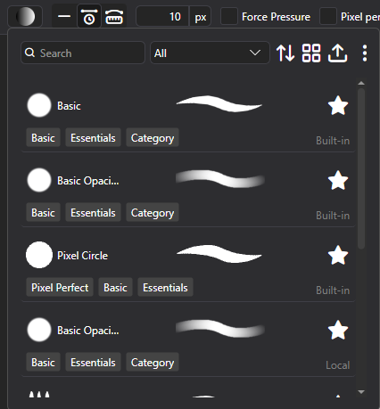
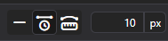
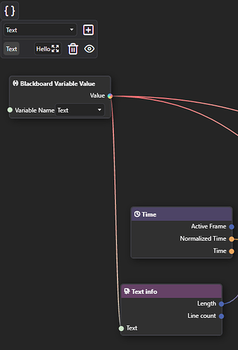
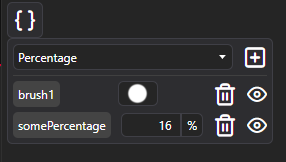
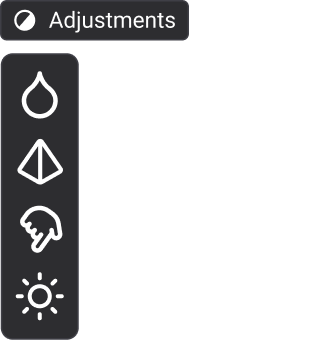
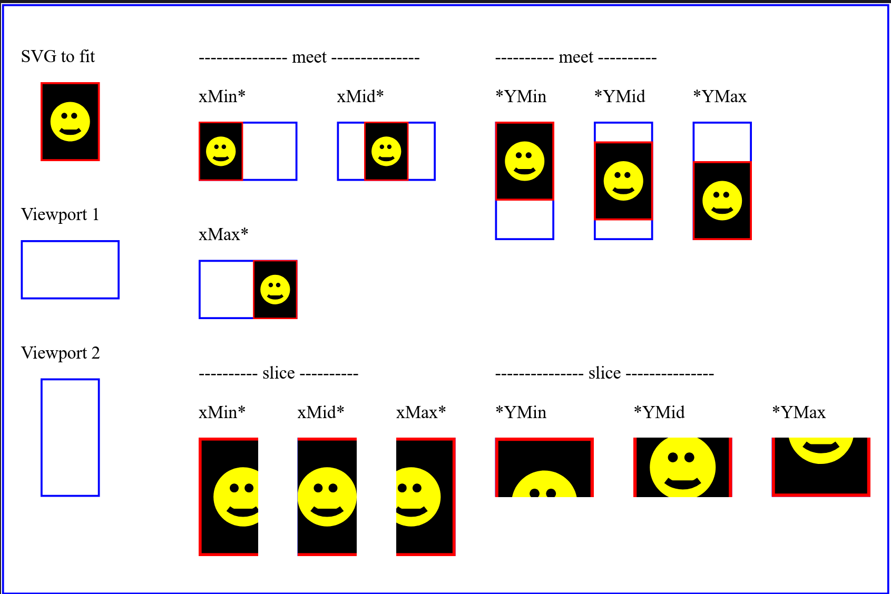
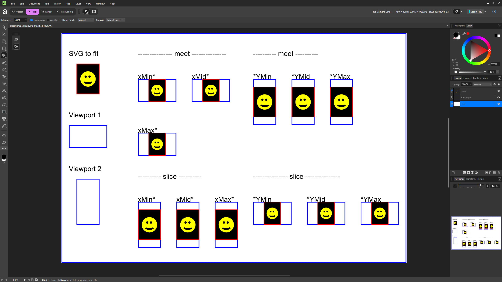
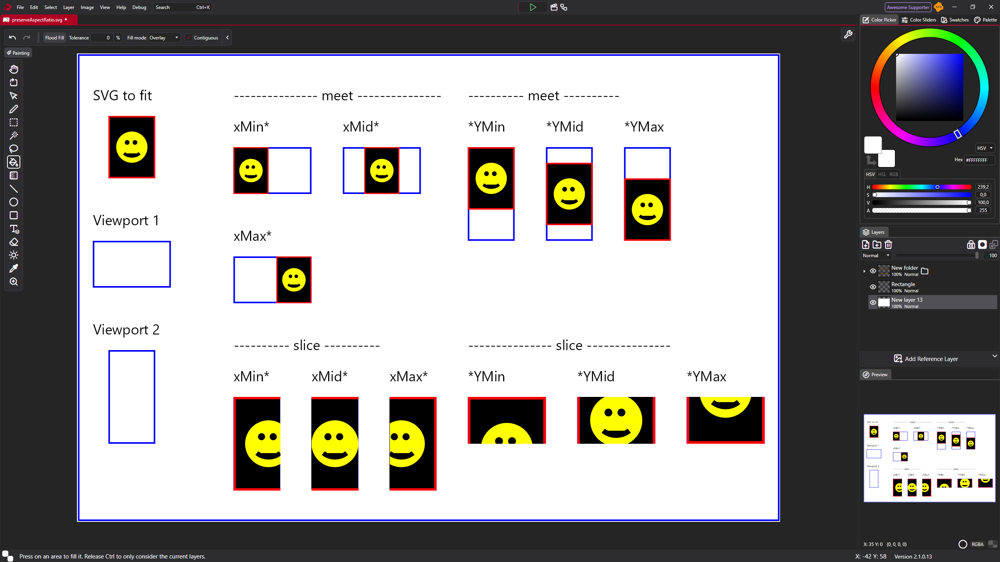
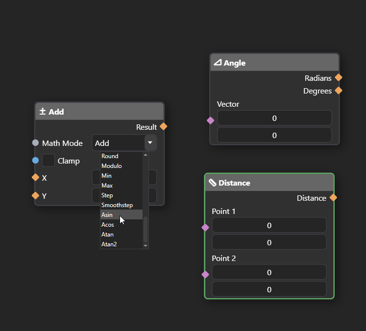

PixiEditor 2.1 has been in development for 9 months, and we're really excited to finally get it into your hands. This release is centered around one big idea: giving you total control over your brushes. Let's get into it.

The full list of changes is available on [our forum](https://forum.pixieditor.net/t/pixieditor-2-1-0-20/578).

## Node-based Brush Engine

Turns out, if you use nodes to build the whole brush system, it quickly grows beyond any expectations.

There are 13 built-in brushes (more coming with each update), that you can test and use as a template for creating your own.

### How advanced are the brushes?

- Fully dynamic brushes, responding to other layers, pen data, time and more
- Custom blending capabilities with SKSL shading language
- Customizable brush settings exposed directly in Pen Tool settings
- Full control over every aspect of the brush, from spacing to rotation and scattering. Access to pointer data, canvas data, editor data and more.
- Shader support for the most advanced brushes
- Create custom tools and save them directly to your toolsets.

Here is a color pencil brush I made using the shader node:

<video src='/videos/2.1-release/color-pencil.webm' loop autoplay muted controls playsinline/>

### Precise paint engine

PixiEditor now uses a precise paint engine. Previously all brush stamps were rounded to pixels, starting from version 2.1, you can paint with sub-pixel precision. Snapped pixels are still an option per brush.

### Stabilizers

Each brush has time-based and distance-based **stabilizers** that can be set to any value.

**Time based**: Stabilization is calculated based on time passed between previous position and new position.

<video src="/videos/2.1-beta/StabilizerTime.webm" loop muted autoPlay controls playsinline/>

**Distance based**: You need to move X pixels before brush follows your pointer. It's like dragging something with a rope, you need to move far enough for the rope to become tight, before it draggs the thing on the other side.

<video src="/videos/2.1-beta/StabilizerDistance.webm" loop muted autoPlay controls playsinline/>

### Customizable Toolsets and Brush Tools

You can now create your own toolsets and tools based on Brushes. Simply create a Brush that does what you want your tool to do, then create a config file to define your tool and toolset. You can also overwrite built-in toolsets' settings and icons.

A great example of what this makes possible is the brand new **Gradient tool** built entirely in the Node Graph. It's literally just a single `.pixi` file and a metadata file for icons, shortcuts, and texts.

<video src='/videos/feb-2026-status/gradient.webm' loop autoplay muted controls playsinline/>

It also makes use of the new array inputs. You can download the `.pixi` file from the [source code](https://github.com/PixiEditor/PixiEditor/tree/master/src/PixiEditor/Data/BrushTools) and check it out yourself. You can make something just like it too!

### Brush Engine docs

If you want to learn more, check out [the docs](https://pixieditor.net/docs/usage/brushes/getting-started/).

## Extension Browser

It is time to test out the extensions system! Below you can find extensions currently available in the browser, along with a short description of what each one brings to the table and how it can help you in your workflow.

*Extensions are not available on Steam.*

### Advanced Pixel Art

Advanced Pixel Art is a set of specialized tools for pixel art. Automatically remove jaggies, easily
create dithered gradients (Linear, Radial, Conical) and draw dithered patterns.

#### Dithering Tool

Draw perfect 4x4 bayer dithering patterns easily. Choose a variety of patterns with density setting and optional background.

#### Dithered Gradient

It's not just a simple dithered linear gradient tool. It features dedicated two-color dithered linear gradient mode and custom gradient option, which includes Linear, Radial and Conical gradients with arbitrary amount of colors and stops. All of them configurable with Steps option, which controls the final palette.

#### Jaggies Remover

Now featuring a tool, that feels like magic. It automatically cleans up all jaggied edges with one mouse stroke. Up until this point, you had to either remeber to always use pixel-perfect mode when drawing or do a tedious work of cleaning everything manually.

Jaggies remover is equipped with two modes:

1. **Clean up all** - By default it considers all pixels of all colors. Useful for single pixel strokes.
2. **Clean up by color** - Holding ctrl only affects pixels of specified color. Ideal if you already have filled shapes and want to clean up the outline.

<video src='/videos/2.1-release/night_sky.webm' loop autoplay muted controls playsinline/>

### Basic Texturing

Basic Texturing Bundle is a set of workspaces for creating cube and tile textures inside PixiEditor. A great starting point for game-ready assets.

#### **3D Cube**
Perfect for creating texture packs for voxel games, with an animated 360° preview so you can inspect every face in real time.
<video src='/videos/2.1-release/block_texture_1.webm' loop autoplay muted controls playsinline/>

#### **Tiled Texturing**
Design seamless, repeating textures and preview how they tile across an infinite canvas.
<video src='/videos/2.1-release/texturing_2.webm' loop autoplay muted controls playsinline/>

### Normal Map Generator

Normal Map Generator is a dedicated workspace for creating and previewing normal maps directly inside PixiEditor. Import your textures, tweak the parameters, and see the shaded result in real time. There's no need to leave the editor!

See your normal map applied instantly with a **real-time shaded preview** and a draggable light source. No need to export to a game engine just to check your work.

This workspace gives you full control over:

- **Ambient Strength**, which controls the base lighting level across the surface
- **Specular Strength**, which adjusts the intensity of shiny highlights
- **Normal Strength**, which defines how pronounced the surface detail appears
- **Normal Sample Distance**, which sets the pixel sampling range used to calculate surface normals

### Skybox Designer

Skybox Texturing is a complete set of workspaces for creating and converting skybox textures inside PixiEditor.

#### **Skybox Equirectangular**
Design full 360° panoramic skybox textures in a single equirectangular canvas with a live spherical preview
<video src='/videos/2.1-release/skybox_eq_1.webm' loop autoplay muted controls playsinline/>

#### **Skybox Cubemap**
Paint all six cubemap faces side by side with a live 3D cube preview to check seams and transitions in real time

#### **Equirectangular to Skybox**
Already have an equirectangular texture? Convert it directly to a cubemap-ready layout without leaving PixiEditor

#### 360° Animations
Additional use-case found by one of our users is 360° animations!

<video src='/videos/2.1-release/skybox_eq_2.webm' loop autoplay muted controls playsinline/>

## Founder's Pack leaving soon

July 30th marks one year since PixiEditor 2.0 launched and changed what we thought this project could be. A year ago we introduced the Founder's Pack, not knowing how people would respond. Today, **584 of you are founders.** A big thank you to every one of you! Thanks to that support, we had the funds and motivation to keep going and that's why today we can introduce Brush Engine and all other features of version 2.1.

If you've been thinking about joining that group, this is the last moment to do it. **Founder's Pack retires on July 31st at 10:00 AM CEST, one year after it launched.** Current founders keep full access to everything, including future updates.

The pack includes 4 workspaces, 21 color palettes, and a badge that shows you were here early. You can grab it [on our website](https://pixieditor.net/download/) or directly from the Extension Library inside the app. [Read more here](https://pixieditor.net/blog/2025/07/30/20-release/#founders-pack).

## Smart Layers

Some of you are probably familiar with Smart Layers. It allows for embedding files in other files (they can be pixi or any other format). With nodes, you can even expose one document's values to a parent document.

A use-case that first comes to mind is embedding an asset within an artwork. In the video below, the tree is reused 6 times, what allows for quick changes.

<video src='/videos/2.1-release/smart-layers.webm' loop autoplay muted controls playsinline/>

Another example is creating text animation template and "Text" blackboard input.
After embedding this animation within other file, you can type your text and it will be passed to the nested document.

<video src="/videos/2.1-beta/templat.webm" loop muted autoPlay controls playsinline/>

This way you can reuse a file multiple times and compose your graphics/animations much more easily.

## Blackboard

Blackboard is our solution for multiple important things:

- It serves as a way to define and reuse constants within one Node Graph
- It defines Brush settings, that are exposed in Pen tool settings when brush is picked
- It allows for defining inputs for graphs. Inputs are a gateway to pass data between parent document and embedded one. If you prefer programming comparison, you can think of a nested graph as a function and inputs as function parameters.

Below you can see how the Noise Scale value of a shader-made brush is exposed to the brush settings.

<video src='/videos/2.1-release/blackboard.webm' loop autoplay muted controls playsinline/>

## Adjustments Toolset

Raster editor without tools like blur, sharpen and smudge felt a bit incomplete. You can now find all these tools in a brand new toolset called "Adjustments". 

This is a pretty basic set for adjusting, we will surely add more there. If you're missing any tools, join our [Discord](https://discord.gg/tzkQFDkqQS) or [Forum](https://forum.pixieditor.net/) and tell us about it. We'd love your feedback!

## Improved animation timeline

This is the first released [community proposal](https://forum.pixieditor.net/t/timeline-improvements/540)!

<video src='/videos/feb-2026-status/newtimeline.webm' loop autoplay muted controls playsinline/>

The most important changes:

- Gaps between cels will now display an empty canvas. Old files still fall back to the base layer (it's possible to enable this behavior)
- Cels can no longer overlap
- Drawing on an empty space will create a cel if it doesn't exist
- Creating a new cel will place it as close as possible to the active frame
- To draw on the base layer, you need to hide the animation for that layer with the eye icon
- Changed the feel and look of cels

## Mushy advisor

Some things may not be obvious. In some places, you might find that little guy giving you tips and asking questions:

<video src='/videos/feb-2026-status/advisor.webm' loop autoplay mute controls playsinline/>

## GIF and APNG to frames

You can finally import GIF and APNG (animated PNG) into frames! Additionally, it is now possible to export an animation to APNG.

<video src='/videos/feb-2026-status/apng.webm' loop autoplay mute controls playsinline/>

## Improved SVG support

The SVG specification is huge, so supporting the entire spec is ... very hard to say at least. It's actually not something we are aiming to do either. For example, you
can embed JavaScript code in the SVG and make it interactive. We don't need that as PixiEditor is a graphics editor.

It is now possible to open an SVG with some filters like `<feDropShadow>` and `<feGaussianBlur>`. They will be converted to appropriate nodes in the Node Graph.

In some cases, our .svg interpreter performs better than Affinity's:

Reference (Firefox):

Affinity:

PixiEditor:

## Non-contiguous fill and magic wand

Off:

<video src='/videos/feb-2026-status/off.webm' loop autoplay mute controls playsinline/>

On:

<video src='/videos/feb-2026-status/on.webm' loop autoplay mute controls playsinline/>

very cool.

## Node Graph Updates

### Stroke Pattern Node

Draw vector stroke out of input image.

<video src="/videos/2.1-beta/repeatnod.webm" loop muted autoPlay controls playsinline/>

### More Math in Math Node

Who doesn't love trigonometry! Math node now includes Atan, Atan2, Acos, and Asin modes. Additionally, there are 2 new calculation nodes: Angle and Distance.

### Adaptable inputs

In a nutshell, it is an input that inherits the type of its connection. It can be synced with other inputs as well.

<video
    src="/videos/feb-2026-status/adaptable.webm"
    loop
    autoPlay
    muted
    controls
    playsInline
/>

### Node Arrays

Arrays are types of structures that can hold multiple values. It's like a box that contains other elements. They are essential in computer science and programming. PixiEditor lacked support for them. This changes now.

There are 'Offsets' and 'Color' inputs. Notice how they look different. They are rectangular. If you try to connect a single value to it, a new intermediate node will pop up.

<video src='/videos/feb-2026-status/arrays.webm' loop autoplay mute controls playsinline/>

Here's a list of "core" flow and utility nodes that we support and plan to support:

- [x] Switches (conditionals/ifs)
- [x] Variables (read only within the graph)
- [x] Arrays
- [ ] Loops
- [ ] Variables (write from within the graph)
- [ ] Events

## New renderer 

A few issues that the new renderer is trying to solve:

- Bad/inaccurate previews
- Bad performance when running some animations
- Better responsiveness of the app

Please report any issues with rendering. If you're interested about this topic in more depth, check out [September Status](http://localhost:4321/blog/2025/10/02/september-status#new-renderer) post.

## 2.1 YouTube Video

You can watch the new features of PixiEditor 2.1 in video format!

<iframe width="560" height="315" src="https://www.youtube.com/embed/hgPQJVViG48?si=Qdc1tqHttiZpmUoq" title="YouTube video player" frameborder="0" allow="accelerometer; autoplay; clipboard-write; encrypted-media; gyroscope; picture-in-picture; web-share" referrerpolicy="strict-origin-when-cross-origin" allowfullscreen></iframe>

## What's Next

Starting with 2.2, each major version will be shaped by community proposals. We think it's the best way to make sure what we build actually matters to our users.

Here's what's currently open for discussion:

- [Vector and Selection Brushes](https://forum.pixieditor.net/t/vector-and-selection-brushes/543)
- [Key Frame Animations](https://forum.pixieditor.net/t/key-frame-animations/542)
- [Extension System V1](https://forum.pixieditor.net/t/extension-system-v1/541)

You can find all active proposals on the [forum](https://forum.pixieditor.net/c/proposals/22) and vote or share your feedback. 

Thanks for reading, and see you in the next one!