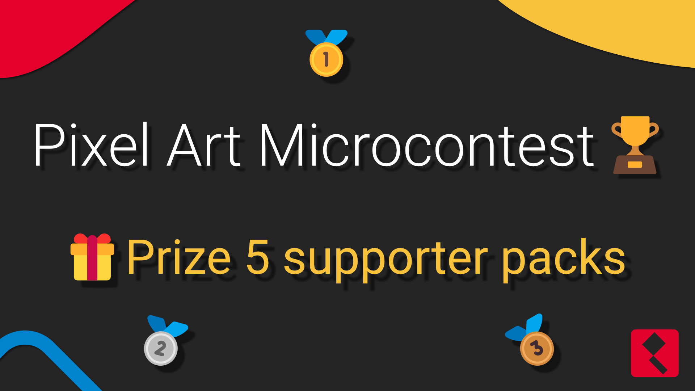

Announcing our second contest! This time prize pool includes 5 Supporter Pack keys!

{/* truncate */}

# Rules

1. Create a pixel art with following theme: **"New Beginnings"**
* You can use any software you want
* Size of the image must be 128x128px
* You can submit only one entry
* Artwork **must** be created by you
2. Submit it to our [Discord server](https://discord.gg/pDXYFkQsnp)
3. Post it on [Twitter (X??)](https://twitter.com/PixiEditor) OR [Instagram](https://www.instagram.com/pixi.editor/), tag us and use hashtag #PixiEditorMicrocontest
4. Wait for the results!

### Deadline: 10.09.2023

# Prizes

Five submissions can win PixiEditor Supporter Pack Steam Key!

Have fun and good luck!