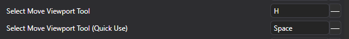
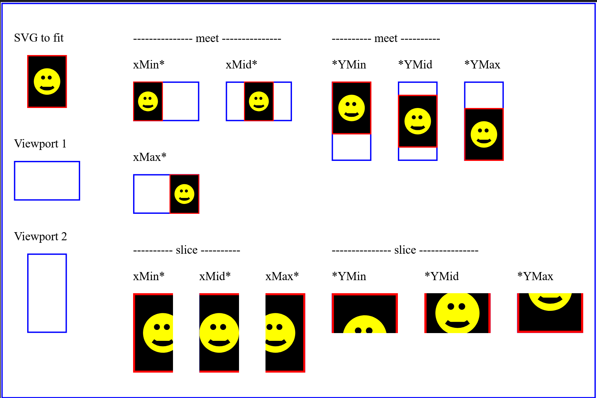
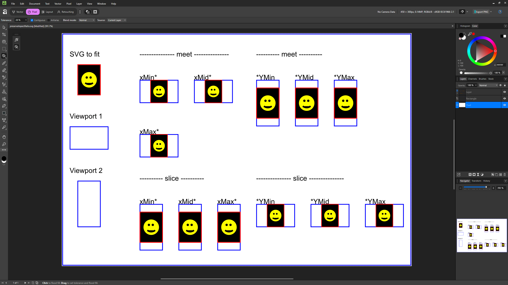
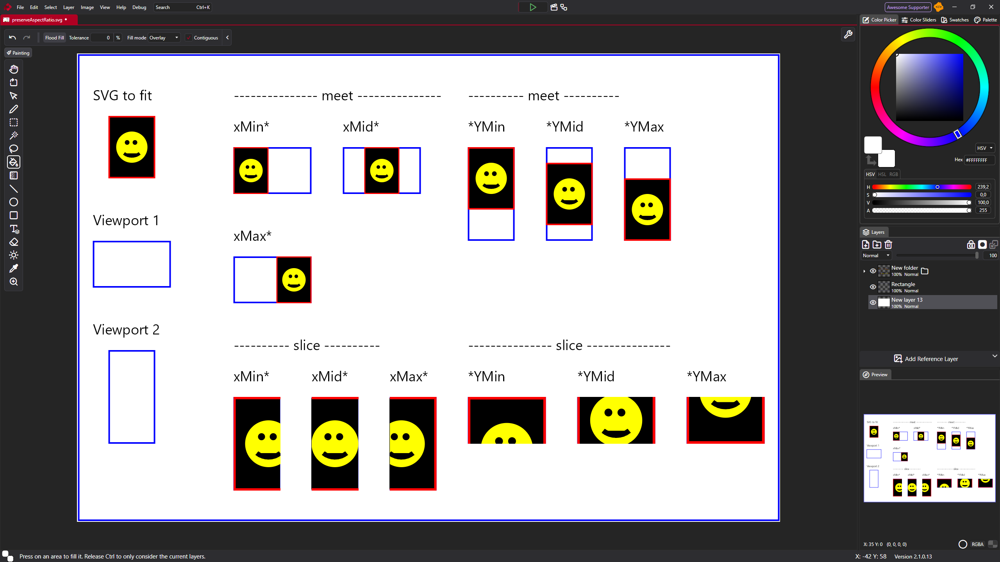
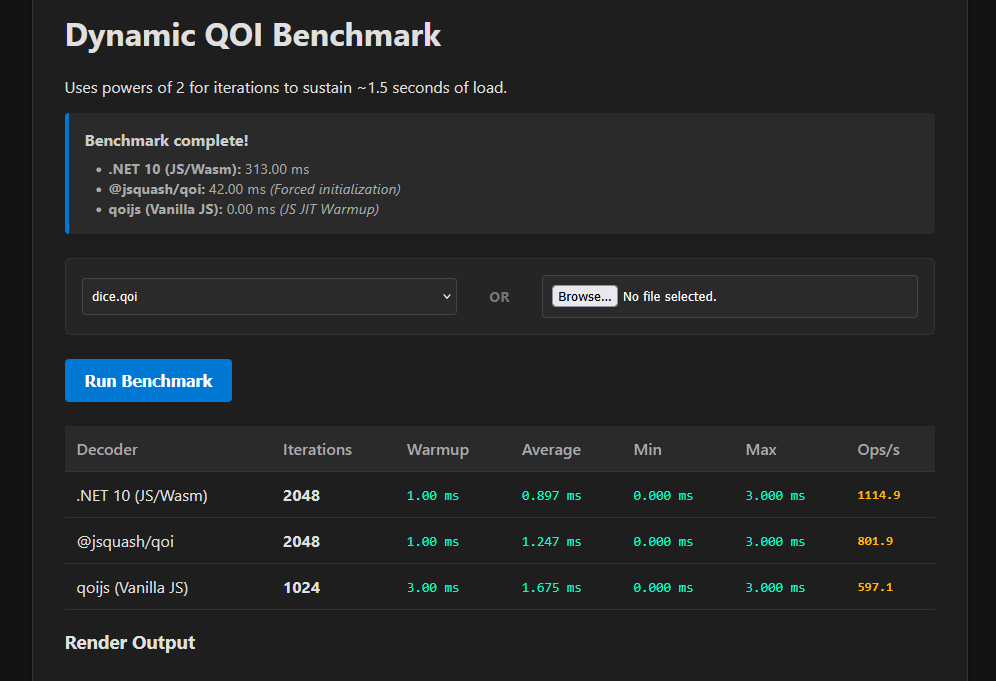
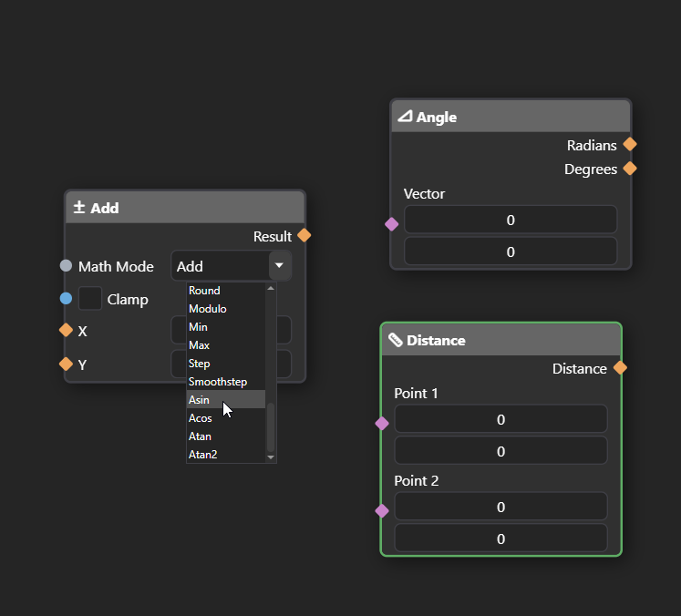

Hello!

First of all, sorry for not posting a status update earlier. We are preparing for the final 2.1 release, and I was too busy with the development. There is so much new stuff, and I can't wait to share it with you.

## macOS binaries for everyone

Before we jump into the new things and status update of PixiEditor, let's start with some news.

Up until now, we've shared macOS binaries bundled with the Founder's Bundle only. It was because developing for macOS is quite expensive, and we had to gather some funds for further development. I am very happy to 
announce that starting with version 2.1, macOS binaries will be available for free for everyone. Steam version included.

Of course, anyone who purchased the Founder's Bundle will still have it. 

In other words, we'll share the macOS version on the same terms as versions for other operating systems. No need to buy Founder's Bundle or compile from source.

## Libregraphics

Folks from the Libregraphics conference reached out to me, asking if I wanted to give a talk about PixiEditor, and I couldn't resist the opportunity. 

So join me on [Libre Graphics Meeting 2026](https://libregraphicsmeeting.org/2026/) in Nuremberg! [I'll be giving a talk about PixiEditor on April 25th](https://libregraphicsmeeting.org/2026/program/talk_pixieditor/). 

Let's have a chat!

## What's coming along with V2.1

As previously announced, we're building a marketplace as a part of our funding plan. It will contain useful workspaces, brushes, palettes, and extensions. I can finally share with you today what kind of extension will be
available on 2.1 premiere.

All tools described below will be made with the Brush Engine. We will not paywall any new features. We have not decided on prices yet, and details of extensions are not final.

There will be 2 bigger extensions and some brush packs.

### Advanced pixel art suite

A brand new toolset with tools for pixel art dedicated to speeding up tedious work, such as auto-dithering and a dithered gradient tool. We're experimenting with tools for auto-removing jaggies, the pixel cluster tool (orphan pixels remover), and the light-aware shading brush.

We're open for ideas, though, if you are missing some specific tool for your pixel art workflow, let us know!

### Texturing suite

A set of texturing workspaces for various scenarios. Such as:

1. Skybox texturing workspace (with live preview of the skybox)
2. 3D parallax workspace (create environment layers and preview parallax effect)
3. Weather stress workspace (a workspace with various effects like fog, desaturation, rain - useful for checking how your textures look in different settings)

It'll include an improved 3D cube texturing workspace and tiling texturing workspace from the Founder's Pack.

We're also experimenting with an auto normal map generator and a generic 3D models texturing workspace. Although the latter may be added after the 2.1 release.

## Compatibility

We are doing our best to ensure your files from 2.0 will work and look the same in 2.1. However, due to the nature of PixiEditor and the infinite possibilities of your graphs, we are unable to test everything ourselves.
This is why we are calling you to action! Please send us your .pixi files made in PixiEditor 2.0 so we can run them on the new version and verify that everything is working properly.

Please do so [here](https://forms.gle/QNmY1RsdkQMysfrV7)

## The state of PixiEditor

Time for the juicy stuff. I don't have an exact release date for V2.1, but we are very close. Overall, we are in the testing-refining phase now. It's a really big update, there's a brand new node-based Brush Engine, Smart Layers, Node Graph Blackboard,
reworked animation timeline, reworked rendering, new tools, full-screen viewports, and tons of smaller features/changes.

We're aiming to release at the beginning of April.

### Reworked animation timeline

This is something many of you requested. We've overhauled the timeline and workflow of the animation system. This is the very first [community proposal](https://forum.pixieditor.net/t/timeline-improvements/540) coming to life.

<video src='/videos/feb-2026-status/newtimeline.webm' loop autoplay mute controls playsinline/>

The most important changes:
- Gaps between cels will now display an empty canvas. Old files still fall back to the base layer (it's possible to enable this behavior)
- Cels can no longer overlap
- Drawing on an empty space will create a cel if it doesn't exist
- To draw on the base layer, you need to hide the animation for this layer with the eye icon
- Changed the feel and look of cels

Please test it yourself on [dev channel](https://pixieditor.net/docs/open-beta/) and let us know if it's better and more pleasant to use! 

For compatibility reasons, files with overlapping frames will still overlap if you open them in version 2.1. If you move them, you won't be able to overlap them again.

### Mushy advisor

Some things may not be obvious. One of these things is smart layers. In version 2.1, importing anything from the outside of the editor will be imported as a smart layer by default. This allows you to do so directly.
Use another .pixi or .svg file as a layer. 

To keep this consistent, normal .png or other image files work this way too. It additionally solves the problem of cutting off parts of the image if you transform it outside of the document bounds.

But there's one problem. You can't directly draw on a smart layer. You need to either rasterize it first or edit the source file. Once you realize this, it's not a problem, but it may look like a bug to someone who
does not know that.

Initially, I wanted to solve this problem by simply displaying a pop-up with a question about the default behavior when a user tries to draw on a smart layer.

But I got carried away a little...

<video src='/videos/feb-2026-status/advisor.webm' loop autoplay mute controls playsinline/>

I added him to a few more places. He not only asks questions but also gives tips. Can you find all of them?

### GIF and APNG to frames

You can finally import GIF and APNG (animated PNG) into frames! Additionally, it is now possible to export an animation to APNG.

<video src='/videos/feb-2026-status/apng.webm' loop autoplay mute controls playsinline/>

### Adaptable inputs

I had this idea in my mind for quite some time already. Some inputs should be able to accept a variety of types. Initially, I just specified the type of the input as an object, which can be basically anything. It is not ideal, though,
color coding of the sockets is one of the main ways to identify what input it is. If every input were an object, color coding and type checking would lose their meaning.

This is why I "invented' adaptable inputs. In a nutshell, it is an input that inherits the type of its connection. It can be synced with other inputs as well.

<video
  src="/videos/feb-2026-status/adaptable.webm"
  loop
  autoPlay
  muted
  controls
  playsInline
/>

### Node Arrays

Arrays are types of structures that can hold multiple values. It's like a box that contains other elements. They are essential in computer science and programming. PixiEditor lacked support for them. This changes now. 

I took inspiration from Blender's Node Graph. The very first Nodes that support them are Gradient Nodes.

There are 'Offsets' and 'Color' inputs. Notice how they look different. They are rectangular. If you try to connect a single value to it, a new intermediate node will pop up.

<video src='/videos/feb-2026-status/arrays.webm' loop autoplay mute controls playsinline/>

Here's a list of "core" flow and utility nodes that we support and plan to support:

- [x] Switches (conditionals/ifs)
- [x] Variables (read only within the graph)
- [x] Arrays
- [ ] Loops
- [ ] Variables (write from within the graph)
- [ ] Events

### Gradient tool

This is another child of the Brush Engine. A brand new tool made entirely in the Node Graph (Brush Engine). Yes, it is literally a single .pixi file and a metadata file for icons, shortcuts, and texts. You can make it yourself, too!

It uses new array inputs, too. You can always download this .pixi file from the [source code](https://github.com/PixiEditor/PixiEditor/tree/master/src/PixiEditor/Data/BrushTools) and check it out yourself. Just make sure you are using at least PixiEditor 2.1.0.13.

<video src='/videos/feb-2026-status/gradient.webm' loop autoplay mute controls playsinline/>

### Bindable tool transient shortcuts

A simple quality of life feature, it is now possible to bind any tool to any shortcut for quick use (hold to temporarily switch to a tool and release to come back to the previous one).

### Improved SVG support

I've built the entire SVG parser and interpreter from scratch for PixiEditor. The SVG specification is huge, so supporting the entire spec is ... very hard to say at least. It's actually not something we are aiming to do either. For example, you 
can embed JavaScript code in the SVG and make it interactive. We don't need that as PixiEditor is a graphics editor.

However, I spent a good amount of time improving our svg support, from edge cases to new tags. For example, it is now possible to open an SVG with some filters like `<feDropShadow>` and `<feGaussianBlur>`. They will be converted to 
appropriate nodes in the Node Graph.

In some cases, our .svg interpreter performs better than Affinity's:

Reference (Firefox):

Affinity:

PixiEditor:

### Non-contiguous fill and magic wand

Off:

<video src='/videos/feb-2026-status/off.webm' loop autoplay mute controls playsinline/>

On:

<video src='/videos/feb-2026-status/on.webm' loop autoplay mute controls playsinline/>

very cool.

### Significant performance improvements

Our little obsession. We've greatly improved loading times and various performance bottlenecks. PixiEditor is now snappier than ever.

And we're not done yet. In fact, CPK developed a brand new QOI encoder from scratch, and it beats or is very close to the original C implementation in encoding and decoding times. We're actually still testing it, so it's not yet part of PixiEditor, but I can't
wait to test how it feels. For context, we are using the QOI file format to save images within a `.pixi` file. Even though it is not a part of PixiEditor yet, you can test it yourself [here](https://actualqoi.pages.dev/) already.

Up to this day, we have been using .NET Standard 2.0 Qoi.Netstandard encoder, which performs quite poorly. We had a choice to use another, faster library, but it would limit PixiParser's embeddability (.NET 8+ minimum) or write our own .NET Standard library.

We plan to include it in PixiParser and open-source it soon.

### More Math

Who doesn't love trigonometry! Math node now includes Atan, Atan2, Acos, and Asin modes. Additionally, there are 2 new calculation nodes: Angle and Distance.

### Color space improvements

I swear, if I had to make a list of things that I'm losing sleep over, color spaces would be in the top 3 if not first.

If you encountered weird color issues, wrong-looking gradients, or anything similar, it should not happen in 2.1 ... I hope.
