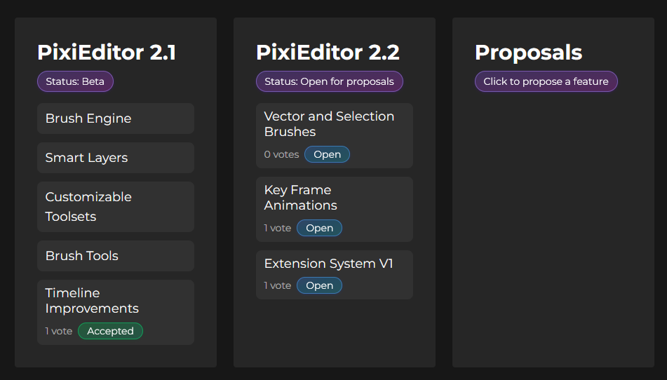

import Newsletter from '../../pages/_index/Newsletter.astro';

I started this year stressed. Very stressed. To the point where my body developed physical responses of tense facial muscles. I've been writing more code, more features... more, more and more.
I worked on PixiEditor full-time, tons of features, even more bugs, requests, and responsibilities. Savings were running short.

This is not a good condition to live in, and definitely not a good condition to create. This was mostly caused by the fact that for the majority of the time, I was the only person developing the app.
Of course, huge thanks to everyone who helped me along the way. From developers (CPK, Equbuxu, Dżejk, and other contributors), through all translators, to all of you who gave kind feedback and reported bugs. 

Even though community response to version 2.0 exceeded my wildest expectations, I mostly felt stress, and I was overwhelmed by everything. 

I realized that I must change the approach. PixiEditor stopped being just my hobby project I made for fun. It's a real tool used daily by a lot of people.

This is going to be a long post, but if you bear with me, hopefully you will feel the spark that I feel about PixiEditor, my life's project. Yes, life's project, something that hopefully will outlive me. 

## Less talking, more listening

We live in a world where on each corner, "everyone" yells that we need to produce more and faster. If we do not replace our minds with the almighty AI, we'll "fall behind" (whatever that means).

To say it's pathetic is like not saying anything, but anyway, it's not yet another post about AI. We're all tired of them already.

All I want to say is, I realized that I should slow down and look back. Sure, PixiEditor is still lacking features, but we'll get there. In 2026, I want to spend 
a good amount of time simply testing, refining, and improving what we have now. Most importantly, though, I want to spend this time on listening. 

I want to sit down and listen to all the feedback I received so far and improve all the features as much as I can. So they feel good to use, and so you want to use them. 

## You

PixiEditor needs a leader. I was focused too much on programming. In terms of leading an open source project, I failed miserably. 

Just look at this: 29 contributors over 7 years. That's whooping 4 contributors per year...

This changes now.

My pledge to you is that in 2026, I will do my best to create an environment where you can influence PixiEditor development much more easily, from open discussions about planned features for upcoming versions to specific code changes.
I want the whole process to be clear, predictable, and fair to you.

While big corporations are busy grinding their quota for the next quarter, I want to focus on a plan that will turn PixiEditor into a reliable, accessible, and powerful tool for years, if not decades.
A tool that not only can replace "the big apps" but also defines the graphics industry.

A plan, in which **you** are a crucial part.

## What is needed for a project like this

A few things:

1. A clear direction and a plan for how to achieve it
2. Open communication with the community and users,
3. Workforce,
4. Funding,
5. And finally, a leader - a role I am finally going to take on

I'll dive into these points in this blog post. Hopefully, it will later be dissected into proper subpages of pixieditor.net, so anyone can find it more easily and not dig through other personal stuff from this wall of text.

## Who am I, and who's behind the project, actually

My name is Krzysztof Krysiński, aka 'flabbet', and I am the face behind PixiEditor since the very beginning in 2018. I've been programming for about a decade now. Besides PixiEditor, I worked in game dev and web development.
I started Pixi Labs, a company that is responsible for the development of PixiEditor and everything associated with it.

Alongside me, there's Anna Kocaj, aka 'Axin'. She's a Product Designer and the one who makes all the pretty graphical stuff in the PixiEditor app, website UI, newsletters, and blog covers.

Philip Kreuz, aka 'CPK' - he keeps the infrastructure alive and codes the main PixiEditor app from time to time.

Egor Mozgovoy, aka 'Equbuxu' - he developed a good chunk of architecture for version 1.0, and now is a person who tests new features and points out holes in my design ideas.

And Jakub Ciemała, aka 'Dżejk' - our first intern!

## The vision

Let's start with _my_ vision for PixiEditor. How I imagine it, and what my motivations are behind the whole project.

Years ago, when I was starting with programming, I used free tools. I downloaded a free IDE (a program for writing and compiling code), I found some free tutorials online, and used a free programming language.
The entry curve (at least economically) was very low. All I needed was a computer and some will. 

This is still the case. The concept of paid programming languages is pretty much non-existent. You can use entirely free tools
to develop and learn. Most of the libraries (pieces of code made by other people) are free. Sure, there are paid tools, but the whole world stands on the fact that technology is
mostly open, and anyone can contribute. If not that, hundreds of thousands of people would never even try programming.

**This is not the case for graphics.** If you don't like GIMP and Inkscape, you are doomed to paid alternatives. I must admit, the amount of freedom of choice and variety in the programming world is a wonder.

I got into game development pretty early, and in game development, graphics are pretty much required. My dream was always to make my own game, so naturally, I needed some graphics software.

From time to time, I wanted to edit an image, resize it, crop it, and so on. Occasionally, I also needed to make a logo or something more related to vectors.

I definitely did not have money for Adobe apps, and I was looking for alternatives. Remember, it was almost 10 years ago, apps like GIMP and Inkscape were in a completely different place. 

I settled with the very first version of Affinity Photo. It was a one-time payment, and even if it hurt a little to pay it (I only had lunch money!) I really enjoyed it, and it worked well for me.

I'd lie if I said that this was the moment I decided to create something better and free, and this is how PixiEditor was born. No.

The first version of PixiEditor was made by pure accident. I was just learning UI controls for the WPF framework from a book, and I happened to place a 4x4 grid of rectangles. 
Something clicked, and I managed to color them by clicking. Viola, pixel art app.

Of course, far from it, but you get the idea.

The current vision is to have a very extensible graphics app that can handle most of the things, has strong fundamentals, and more advanced use cases can be achieved by customizing the Node Graph, browsing community-made workspaces, or browsing community extensions.

So even if you can't make something easily in the base app, you'll be able to find pre-made workspaces, toolsets + brushes for your use case or plugins in the community plugins browser.

Let me give you an example:

I want to create my own game. I need to pack multiple textures into one. Since I am using PixiEditor to create my textures, I may find a workspace that does channel packing for me.
I open the marketplace and look for "Channel Packing". There is one made by `channel_packer_2137`. I open it, drag my source textures to the layers, and it's done. I can now export a packed texture.

### The all-in-one app

PixiEditor is meant to be the Universal 2D Graphics Editor - and by that, I mean that every component of the app should be complementary to each other. 
I want to blur the line between vector graphics and raster graphics, at least editing-wise.

How?

All powered by the Node Graph - each property of the layer can be connected with other layers and all the other nodes. 

Even if I didn't think of something and didn't implement this very specific thing for your use case,
I guarantee you that you can hack your way out with the Node Graph. 

I've created a voxel texturing workspace with 2 outputs: a shader that renders a cube and a texturing layer. Even though there is no "handle" system in the node graph, I simply
used a vector layer with a rectangle and plugged its position on the canvas to the cube's rotation.

Hacky? Of course. Does it work? Hell yeah.

_(for the record, in 2.1 beta, there is a full-viewport rendering option and enough viewport data to properly create this cube rendering viewport. Without creative solutions as above)_

### Tools for everything

The heart of the tools workflow in PixiEditor is a node-based Brush Engine. Currently in Beta (available to test on [development channel](https://pixieditor.net/docs/open-beta/)).

How is it different from the other Brush Engines?

Full control over Brush creation! No hidden logic, pretty much all the settings and functionality can be customized via Node Graph. You can change position on the canvas (paint is applied to a different position than the pointer position), 
shape, size, and blending. You can use custom shaders, read keyboard modifier keys, pointer data, sample other layers, and so on. Sky's the limit!

This system is so flexible that it can be used to create custom tools. We've fully replaced the brightness tool with a single .pixi file that contains the brush graph. We are planning to do this much more often, and so will you (I hope)!

The best part is, if you create a cool brush, but you don't want to constantly select it in the brush picker, you can tell PixiEditor to put it into the toolset. You can create custom toolsets and overwrite built-in tools.
All of this without writing a single line of code (well, unless you write a custom shader within the node-graph!). No other art program I know is so customizable in that matter.

Even though right now, Brush Engine only allows for manipulating Image Layers, I don't see why it couldn't do the same for vector layers and selection. After all, it is all powered by the very same Node Graph PixiEditor uses to render vectors.

This concludes the first major component of my Universal 2D Graphics Editor vision - user customizable tools.

### Animating

Another important part of the app is animations. At the moment, you can animate image layers frame by frame or create animation within the Node Graph.

Right now, Timeline and Node Graph are separate systems. They have no knowledge of each other. In my vision, you should be able to create full-blown animations within PixiEditor. 
It should work both ways - there should be custom clips that define their own graphs (like DaVinci Resolve), and the document Node Graph should be able to access clips/key-frames/cels.

Achieving that should be incremental. We have a raster frame-by-frame system, so the next step is to add a possibility for frame-by-frame vectors, then key frame animations to both, and lastly custom Node Graph clips.

PixiEditor has almost everything for another animating type - skeletal animations! I am not saying we're going to implement it for sure, but I don't see why we shouldn't try. 
[There was even a guy on Discord once, who already built a rigging setup with Node Graph and vector layers only](https://discord.com/channels/726445255175438346/1313023686260817920/1361714669877858396)

### Vectors

Vectors are meshes for 2D. They're not just for logos. The sheer number of things you can use them for is amazing. Besides expanding the vector toolset and improving the vector creation and editing workflow, I want to 
treat vectors as Blender treats geometry.

So we are talking about geometry modifiers, vector brushes (so you'll be able to sculpt, for example), and advanced font usage.

### Compositing

Version 2.1 will bring [Nested Document Layers](https://pixieditor.net/blog/2025/12/10/21-beta/#smart-layers). It's like a smart layer on steroids. You can make a text animation, for example, and embed it 
into another document. This allows for reusable components - perfect for compositing.

You should be able to compose advanced pieces out of small components. I believe PixiEditor's smart layers already does 90% of the heavy lifting, but node graph animation clips I mentioned earlier are the remaining piece of the puzzle.

### Extensions

The extensions system is already a part of PixiEditor. The API is just not yet ready for the public. I believe it has very strong foundations and it is based on relatively new technology - [WASI](https://wasi.dev/).

Wasi stands for "Web Assembly System Interface", don't let the name fool you, it has nothing to do with the web. In simple words, it allows running extensions written in other programming languages inside PixiEditor safely.

A huge advantage of it is sandboxing. It means that every extension will be constrained by PixiEditor, and it won't be able to do any shady stuff without your knowledge. We are designing an aggressive permissions system
for extensions, so you'll be well informed of extension intentions.

It's not just a theory. Founder's Pack is already a WASI extension running inside PixiEditor. It's just a matter of finishing the API. I want to do it properly, with versioning, compatibility, and most importantly, a community extension browser!

I don't like looking for extensions all around the web. I like having extension browsers and just scroll through them.

### Folklore Runtime

Now we are entering hardcore stuff. I want to bring the PixiEditor Node Graph runtime outside PixiEditor. 

What does it mean?

It means that you'll be able to open .pixi files outside PixiEditor. For example, in your game engine directly. Because why not? Skipping the import and adjustment part can save a lot of time.

This sounds easy, but it is, in fact, an extremely challenging task. We've figured out the best way is to create a [custom programming language called 'Folklore'](https://github.com/PixiEditor/Folklore) and rewrite
every PixiEditor Node to it. It is on a very early stage, and we're likely speaking 2028 in the best-case scenario, but on a theoretical level, we have it figured out.

We are talking about running .pixi files in game engines, web browsers, or even as part of a system image viewer (interactable graphics format, anyone?).

## Major versions and proposals system

To increase your influence on the project, I've prepared a plan for a clear and predictable release planning pipeline. 

I'll break it down into sections on how you can help develop PixiEditor and what you can expect from the development process.

### Feature planning

Each major version will be composed of _feature proposals_, each proposal will be in a 3-month period, where it is open for discussion on the forum. After that, the proposal will be either rejected, accepted, or moved to other major version planning.

Everyone will be able to propose changes/features, but only the best will be moved forward.

Proposal statuses: `#review_pending` \<--> `#more_information_needed` -> `#open_for_discussion` -> `#accepted` or `#rejected` or `#frozen`, where frozen means that proposal discussion will be continued in the next major milestone.

Each proposal will have its progress status updated and PRs linked.

#### Proposal requirements

Each proposal must contain: 
1. A clear description of the proposal: is it a completely new feature, an extension of the existing system, or an overhaul of the existing system?
2. A clear description of what the proposal solves and what the rationale behind it is.
3. Who will benefit from the described changes (what group of users will feel the changes)
4. References, if available

The proposal needs to be professionally written, and proper research about the topic must be included. Low-effort submissions will be rejected. 

#### How is the proposal different from feature requests on Forum/GitHub?

Proposal requires more work, and it goes through a longer process, but if accepted, it is guaranteed to be implemented in a given version. We guarantee to at least give feedback about why the proposal got rejected.

Whereas feature requests are a way to dump your idea and show us that you'd like something. We might consider it if we decide it is a good idea. It's entirely up to core developers if the feature request is considered.

The core development team will use proposals for major features and redesigns, so they can be discussed with the community.

Version 2.1 is already far into the development process, so the proposal system will begin with version 2.2.

## More information on the website

We've also included more information on the website so you can find information about vision, contributing, roadmap, current status of the app, and tutorials on how to get into PixiEditor development.

### Better roadmap

PixiEditor's website now shows an up-to-date roadmap based on the [proposal system](#feature-planning). [Check all the proposals here](https://forum.pixieditor.net/c/proposals/22)

## Better communication

Up until now, I've been releasing monthly PixiEditor Status updates. Our plan for 2026 is to improve communication even more.

### Livestreams

I'll be doing weekly livestreams (every Friday) with different topics. Starting 23.01.2026. Here are the planned topics for the next 3 livestreams:

- 23.01: Exploring Brush System
- 30.01: Contributing and codebase walkthrough pt. 1 - overview
- 06.02: Noises - exploring seamless noise techniques

Join me on [YouTube](https://www.youtube.com/@PixiEditor)

### Tutorials

I planned tutorials for a long time, but never got time to do them. This year, I'll connect it with livestreams. One livestream of the month will be dedicated to some topic, which I will convert
to a written (or a video, we'll see) tutorial. They're not only going to be about using PixiEditor, but also about more theoretical things. In fact, the very first tutorial will likely be about Noises. 

I'm going to add a dedicated section on pixieditor.net with tutorials.

### Newsletter

We're going to share important events, status updates, new tutorials, and other relevant stuff in our newsletter. Starting this month, we're planning to send newsletters once a month. Make sure to join if you like the project.

<Newsletter hideMushy/>

## Funding

PixiEditor is an open-source app. It was built to be an open-source app, and everything it stands behind is based on being open source.

Though it's not just a fun hobby project anymore, it needs funding.

A lot of open source apps base their funding on sponsors and donations. This works well for some of them, [recently KDE surpassed over 100k EUR on user donations](https://www.reddit.com/r/kde/comments/1pgkwlg/kde_surpassed_their_2025_100000_eur_fundraiser/). 

This, however, is not my cup of tea. I prefer to build something of value and just sell it to you - aka, a sustainable business model.

I want to be clear and open about how we're going to do this.

### The app itself

First and foremost, **the base open source PixiEditor app is going to be free, always**. We do not plan to chop its features and sell them either.

### Content

PixiEditor's Node Graph is a really powerful tool and allows for tons of amazing configurations, but it's a skill that you need to learn. 
We have full know-how and plenty of cool ideas on custom workspaces and brushes, which we want to share with you.

In version 2.1, we are planning to add a marketplace with free and paid pre-made workspaces, brushes, palettes, and other stuff that we might come up with. Most of the things you'll be able to buy there 
will be something that you would be able to make yourself. In other words, we'll create things using PixiEditor's core systems that everyone has equal access to.

This way, we can share useful setups and tools, and you can support the development. It's a win-win. 

Additionally, each time I have an idea for some workspace, I usually find myself in need of some specific node that does not exist or some other mechanism. In that case, I just add it to the core PixiEditor app, which is available for everyone for free. 
So everyone benefits even without buying these workspaces.

The marketplace will primarily work in an ownership model. So buy once, and it's yours. 

We are also considering an alternative access to marketplace items. Eventually, the marketplace might 
have a lot of items, and buying all of them might get really expensive really fast. So _we might add_ a subscription model to access all of them with a fixed monthly fee. I am not a fan of subscriptions, but
I think it is fair as an alternative to the traditional buy-once model.

## Afterword

The future of PixiEditor belongs to you. If you like what we're doing here, please consider supporting us with a Founder's Pack, donation, star on GitHub, testing, code contribution, or just by sharing. 

This is a critical moment for PixiEditor's future. We're living in a world where corporate control gets tighter and tighter. Tools like Blender proved that open source can be an industry standard. We're 
going to do the same for 2D creative software. All we need is your support.