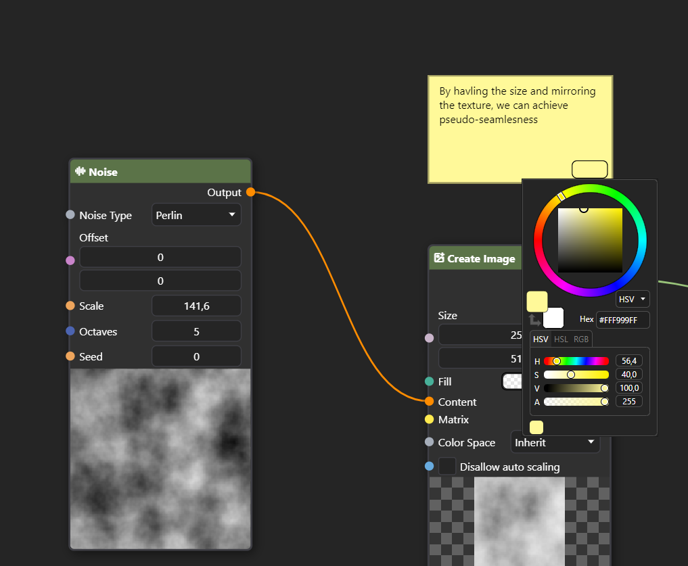
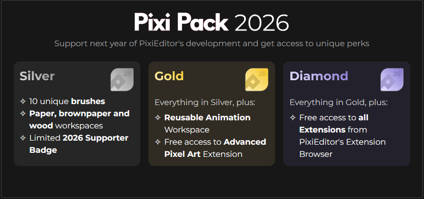

## What a year it has been!

It's hard to believe that one year has passed. It's a good moment to summarize what has happened over that time and what lies ahead. 

Before we start, I'd like to thank everyone involved in any way in PixiEditor's growth - a big thank you to all the Founders, contributors, translators, dev version testers, people who gave useful feedback, champs who spread the word about the app, and all of you who simply use it!

This project is all of us.

## Numbers!

It's always fun to look at some numbers. Here's how the first year of 2.0 looked:

**Period: 2025.07.30 - 2026.07.30**

### Updates

<table class="stats-table">
  <thead>
    <tr>
      <th>Metric</th>
      <th>Count</th>
    </tr>
  </thead>
  <tbody>
    <tr class="highlight">
      <td>Total updates</td>
      <td>54</td>
    </tr>
    <tr>
      <td>Development versions</td>
      <td>32</td>
    </tr>
    <tr>
      <td>Stable releases</td>
      <td>22</td>
    </tr>
    <tr class="sub-row">
      <td>Major releases</td>
      <td>2</td>
    </tr>
    <tr class="sub-row">
      <td>Minor releases</td>
      <td>3</td>
    </tr>
    <tr class="sub-row">
      <td>Patch releases</td>
      <td>17</td>
    </tr>
  </tbody>
</table>

### Downloads

<blockquote>
  The figures below represent downloads and installs, <strong>not unique users</strong>.
</blockquote>

<table class="stats-table">
  <thead>
    <tr>
      <th>Platform</th>
      <th>Count</th>
      <th>Notes</th>
    </tr>
  </thead>
  <tbody>
    <tr>
      <td>Standalone</td>
      <td>112,951</td>
      <td>Downloads + Updates</td>
    </tr>
    <tr>
      <td>Steam</td>
      <td>29,306</td>
      <td>Complimentary Units</td>
    </tr>
    <tr>
      <td>Flathub</td>
      <td>30,244</td>
      <td>Installs + Updates</td>
    </tr>
    <tr>
      <td>Flathub (New Installs)</td>
      <td>12,786</td>
      <td>First-time installs only</td>
    </tr>
  </tbody>
</table>

### GitHub

<table class="stats-table">
  <thead>
    <tr>
      <th>Metric</th>
      <th>Count</th>
    </tr>
  </thead>
  <tbody>
    <tr>
      <td>Contributors</td>
      <td>18</td>
    </tr>
    <tr>
      <td>Commits</td>
      <td>1,022</td>
    </tr>
  </tbody>
</table>

## What we achieved in this one year

Below is a short list of mention-worthy achievements. Ff you're interested in a more detailed (and visual) list, [check this blog post](/blog/2026/04/30/21-release) 

### Brush Engine

Undoubtedly the biggest achievement is the Brush Engine. Brushes are entirely powered by the node graph with customizable options, stabilizers, sub-pixel drawing precision, and an ability to customize toolsets with brush-based tools. Additionally, we've added proper drawing tablet support across all operating systems. We wrote a custom implementation for the Wintab API on Windows to support a wide variety of devices along with the existing Windows Ink API.

Additionally, we've added 7 new tools inside a new "Adjustments" toolset. Made entirely with Brush Engine.

<video src="/videos/2.1-beta/StabilizerTime.webm" loop muted autoPlay controls playsinline/>

### Smart Layers

Any file you make can now be embedded inside any other file with exposed customizable parameters through the new Blackboard system. This allows for reusable graphs, custom nodes, and better organization inside the graphs.

<video src='/videos/2.1-release/smart-layers.webm' loop autoplay muted controls playsinline/>

### Extension Browser

We laid the groundwork for a community extension library. We've released 7 extensions with custom workspaces, tools, and functionalities. In the following year, we are planning to open it for community extensions.

### Node Graph

During the year, we introduced dozens of new nodes and data types, including gradients, color ramps, vector math, procedural noise, text utilities, array operations, palettes, random generators, and many more. Additionally, thanks to the community, PixiEditor also 
got 2 special nodes: Sticky Note and Comment Zone - both greatly improving organization within the graph. 

### Animation system

This is the first [community proposal](https://forum.pixieditor.net/t/timeline-improvements/540) coming to life. We've improved the animation system based on user feedback. The timeline was redesigned with many long-requested workflow improvements.

<video src='/videos/feb-2026-status/newtimeline.webm' loop autoplay muted controls playsinline/>

### Rendering 

We rewrote large parts of the rendering engine, bringing noticeably better responsiveness. This allows us to go forward with another more advanced optimization technique we have planned for this year.

### Other things

We've added plenty of new sample files, made hundreds of bug and crash fixes, improved SVG support to handle an even wider variety of cases ([sometimes beating Affinity](/blog/2026/03/11/feb-2026-status#improved-svg-support)) and much, much more.

Besides developing PixiEditor, we've also contributed to Avalonia UI and added [drawing tablet support for Linux](https://github.com/AvaloniaUI/Avalonia/pull/19910), fixed [repeating keys on X11 bug](https://github.com/AvaloniaUI/Avalonia/pull/20360) 
and [invalid intermediate points order for windows](https://github.com/AvaloniaUI/Avalonia/pull/20075).

Earlier this year, we hosted a student for a 3-month apprenticeship at Pixi Labs. It was a great opportunity to introduce him to graphics programming and OSS development in general. He made contributions to PixiEditor by working on the extension browser, infrastructure improvements, and implementing several new nodes. This is exactly the kind of opportunity I want to create more of. I want Pixi Labs to be a place where people can learn and build meaningful things. Especially in a world increasingly focused on replacing human work with "automation" of questionable quality.

 None of it would be possible without our supporters. All of the revenue from Founder's Pack went into investing in infrastructure, development hardware, trademarks, certificates, and most importantly, <u>humans.</u>

## Goodbye Founder's Bundle

Releasing version 2.0 was a jump into deep water. We're not a big corporation with millions in a budget for market research, discovery, and marketing. We were (and still are) just a bunch of people with a pure idea in our minds to 
build useful software with capabilities unseen in other editors.

With the launch of version 2.0 one year ago, we've released a supporting package called Founder's Bundle to fund the development. It did its job, and thanks to all of the Founders, we've managed to release version 2.1 with a node-based Brush Engine, improved 
animation timeline, tons of new nodes, improved rendering, and much, much more. 

As the name suggests, Founder's Bundle was meant to be a package for Founders - people who believe in the idea and want to see it grow. That's why, after one year, we are letting it go. We've built a solid foundation. The founding phase is over.
Once again, thank you to everyone who believes in the project and decided to support it financially. You are directly helping us build a better future for FOSS graphics editing software.

## Hello Pixi Pack

Well, ending sales of the Founder's Bundle does not mean we've earned enough money to develop PixiEditor forever (sadly, the Nigerian prince has already given everything to a guy named Michael Scott). So, what's the plan to keep going? While extensions in the extension library are a nice addition to the budget, it is not sufficient, so we've decided to divide PixiEditor into yearly funding periods. The first one is behind us (Founder's period).

We're entering the 2026/2027 funding period with Pixi Pack 26. It comes in 3 flavours - silver, gold and diamond. Unlike Founder's Bundle, Pixi Packs are tiered. The theme of this year's Pixi Pack is "Painting" as it comes with a brush pack and 
unique workspaces with painting surfaces (paper, brown paper, and wood tiles). After one year, some perks from this Pixi Pack will be gone, and a different pack will take its place.

<figure>
<video src='/videos/one-year-v2/paper.webm' loop autoplay muted controls playsinline/>
<figcaption>Paper workspace from Pixi Pack 26</figcaption>
</figure>

As I said, we're dividing funding into yearly periods, so with each funding period we're gonna have specific goals and a roadmap.

## Goals for period 2026/2027

The first year of 2.0 showed us that the number of use cases for PixiEditor (and expectations) are extremely broad. Some of you use it for simple image editing and manipulation, some for drawing pixel art, and some for extremely specific niche cases with complex graphs.

That's why we need to think just as broadly. Additionally, it came as a little surprise to see how differently PixiEditor works and behaves on a variety of hardware and operating systems. So the next year will be mainly focused on two major things:

### Extendability

As I said, we can't possibly think of all use cases and prepare a specific feature for each of them, but we can invest in configurability and extendability so you can work your way out and share it with others.

**With PixiEditor 2.2, we want to finish the first version of the extensions API and create a community extension/asset library**

It's not just extensions with custom code. We want all of you to be able to share your work. If you made some useful setups/graphs and brushes, you'll be able to publish them to the community library. 

For example, with the extensions API, anyone will be able to make custom file format parsing, so community support for almost any raster (and not only raster) files. Krita's `.kra`, Photoshop's `.psd`, OpenRaster format, HEIC, JpegXL, and any other you can think of.
It will be as easy as just clicking "install" in the extension library.

### Stability, performance and UX issues

PixiEditor's rendering is very complex. It is entirely based on the GPU, and some hardware and software combinations are not working smoothly or stably. Additionally, Brush Engine pushes limits again as it allows for pretty much 
custom (and possibly very heavy) brushes to execute hundreds of times per second. 

We already have 2 draft solutions for greatly improving performance and smoothness ([Action scheduling](https://github.com/PixiEditor/PixiEditor/pull/1666) 
and [Iterative rendering](https://github.com/PixiEditor/PixiEditor/pull/1660)) in works.

**We want to invest a lot of time into optimization and app stability. Especially drawing and editing performance.**

Some of PixiEditor's features are limited by the UI framework PixiEditor is built on (AvaloniaUI). We're currently on version 11, which does not include things like drag and drop for Linux and Wayland support. Thankfully, version 12.1 was released recently, which adds both of these.

It's not a trivial task to upgrade, as we are using a custom fork of Avalonia (which adds Wintab API for Windows and a few patches) and a custom GPU interop solution, but version 12 promises better stability, missing UX features mentioned earlier, and improved performance
and much more that PixiEditor can benefit from.

**There are other issues with the UX of PixiEditor itself, which we want to address as well (such as more text options, easier filters with a dedicated window, layer locking, and more)**

### Extended documentation, tutorials and more resources to learn from

PixiEditor is complex. I want to invest time into making YouTube tutorials, extend documentation with more examples, and generally make more content so it doesn't feel like you're alone in figuring everything out.

Oh btw, do you know you can help improve documentation? [It's open source!](https://github.com/PixiEditor/PixiEditor.net-Docs).

## Fin

I am really excited for the next year. Again, thank you to everyone involved in PixiEditor. Keep up the great work and see you in the next status update! If you believe in the project or just like what we do, please consider supporting
with Pixi Pack! 

 
 
 
 

P.S. Did you know there are some ants that are literally born to be a door? Just look at this

<figure>
    
    <figcaption>
    Matie has a DOOR for a HEAD (photo taken from 1 minute animals on YT)
    </figcaption>
</figure>