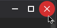
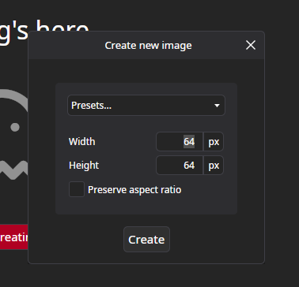
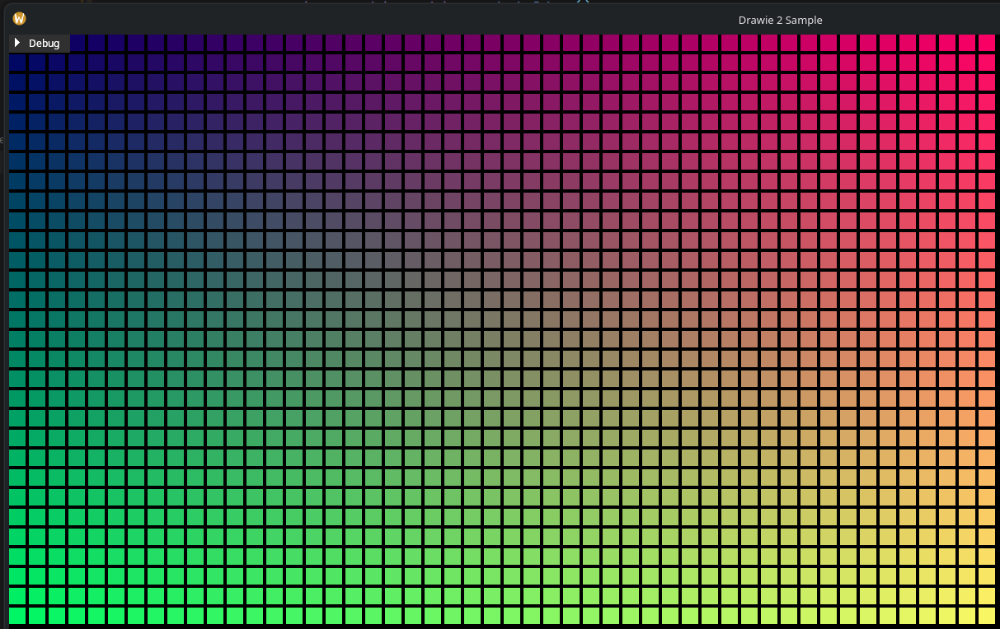

import Newsletter from "src/pages/_index/Newsletter.astro"

Hi, hello and welcome! What a great day for some news and PixiStories. On today's menu:

- Project Polish (v2.2) - a roadmap for stable, friendly and polished PixiEditor,
- Drawie 2 - an upgrade for our rendering technology,
- Vertie - an experimental 3D backend for Drawie,
- Arco - a brand new drawing backend, made from scratch. Why and how.

Let's get into it!

## Project Polish

Despite the name, it's not a lesson about how to pronounce "Brzęczyszczykiewicz". Yes, PixiEditor is made in Poland and yes, I am Polish, but that's just a coincidence.

Anyway, Project Polish is our roadmap to fix most of the rough edges of the app, from missing basic features, to UX improvements and long-standing bugs.
Additionally, we're finally preparing proper tutorials, aka. "PixiEditor Essentials". In fact [the very first UI walkthrough is already available on our docs!](https://pixieditor.net/docs/handbook/essentials/hello-pixieditor/) 
YouTube version is on the finish line.

So, what's should you expect? On our internal roadmap we have things like:

- Layer locking
- Alignment options (center elements within selection horizontally, vertically etc.)
- More text options (inlines, alignment, kerning, variable fonts, proper emoji-within-font support and more)
- Filters panel for quick layer filter compositing
- Improved vector workflow and more vector tools like knife, fill, quick bool operations and expand to stroke
- Better Node Graph UX (layout management, insert node on connection)
- New selection tools
- Improved touchscreen and touchpad controls
- Upgrade to avalonia 12 (Linux drag and drop, better performance and stability) 
- Improved welcome screen 
- Startup performance improvements
- Performance improvements
- Better clipboard support when it comes to copying and pasting to/from other apps
- General UI polish

It is not the final roadmap for version 2.2, it's our internal milestone that we want to accomplish for version 2.2. There are some [interesting community proposals open](https://forum.pixieditor.net/c/proposals/22), which we are planning to go over soon and update 
the roadmap on the website. Take a look and vote for your favourites, it's not too late!

Some of the things from Project Polish we've already implemented, but not yet released. For example

### Avalonia 12 and UI improvements for Linux

Previously, PixiEditor had windows-like titlebar on Linux, which does not fit the ecosystem. With Avalonia 12 upgrade, I've decided to refresh it's look



Additionally, on some distros with disabled system title bars, PixiEditor's popups did not have borders and blended with the background. It's a small thing, but adding borders really improves the overall feeling



One of the biggest UX issues on Linux so far was not working drag and drop, it was the limitation of Avalonia 11 and with version 12 upgrade, we can finally drop our precious files!

Avalonia 12 also brings experimental Wayland support. I did try enabling it and testing, however for now it's not usable with PixiEditor. We'll have to wait for it to get a bit more mature and adjust our rendering tech for it as well.

### Some juicyness

I come from a game dev background and term "juicy" is used a lot in context of visual feedback of game elements in response to user input. In other words, how squishy and satisfying the interactions are visual-wise.
Avalonia's animation system is pretty powerful, but extremely unfun to use. The mental strain to add the most basic interaction is too big for me to usually do it in between more important tasks.

To be honest this applies to majority of UI frameworks I used. At least without any plugins and external packages.

But one day, I saw this [GodotHub](https://github.com/RykoTheDev/GodotHub) app, which does an exellent job with satisfying and juicy UI. It was the push I needed to actually do something about 
the lack of easy way to juicy-up things in PixiEditor. So, in one evening I coded a simple solution called `Juicy`. 
With it, adding animations is stupidly simple. Let's take a look at tool buttons.

<video src="/videos/status-26-september/Juice2.webm" width={70} muted autoPlay loop controls/>

All it took to add this was:

```
Juice.Animations="Loaded:PopIn"
```

Majority of icon buttons in the app now respond to your clicks!

<video src="/videos/status-26-september/Juice.webm" width={150} muted autoPlay loop controls/>

The syntax follows "event:animation" schema, it is also possible to specify multiple animations within one element by separating them with `;`. 

Well anyway, I won't bore you with technical details, all it matters is that it is very easy to add juicyness to the app, which I am happy about and hopefully use more often.

## Drawie 2 

Drawie is what powers PixiEditor, it's a technology we built from scratch and have great plans for. In essence, Drawie in its current form is a library which talks to your GPU and sets up 
a library called Skia, which does the actual rendering. Drawie introduces a few useful concepts on top of Skia, which makes the development easier.

In context of PixiEditor, Drawie talks to Avalonia, asks for GPU, sets up Skia and forwards all rendering (like Draw Rectangle) to it, then it takes the result and gives it back to Avalonia for you to see.

Outside of PixiEditor, Drawie is also a standalone platform, it does not require any UI framework and allows rendering things on the screen in different enviroments (like standalone desktop app or in the browser).
So you can pretty much build your own UI framework, app or 2D game which will run on desktops and browsers, Drawie takes care of creating windows, managing input and displaying your 2D graphics.

Well, that's at least the idea of it. Standalone platform is far from being complete or even being semi-complete, but I did manage to get it to the point where I could use it for my internal needs.

The challenges we faced for PixiEditor taught us a lot about graphics APIs, limitations and rendering in general. I want to take Drawie to the next level. 
The next 2 sections of this blog are examples of what I want Drawie 2 to be and what it can give you in terms of PixiEditor.

## Vertie - introducing 3D backend for Drawie

At the beginning of the month I was supposed to be in the mountains, a short break from coding and managing the project. Well I was, but after a few days I broke my foot and was forced to go back in front of the computer.
Well, I guess the world has decided, that touching grass is not for me.

I didn't want to go back to the usual bug fixing and implementing requested features, after all I was supposed to be outside for the next 2 weeks. So I decided to experiment a little and do some stuff I 
find fun and a little challenging.

Why not add 3D rendering to Drawie? Making a 3D renderer in itself is already a fun thing, but no too hard by itself. More challenging part was adding a 3D pipeline and integrating it with Skia. My goal
was to build it the way so it feels like it is an integral part of the library instead of an external feature glued together with existing stuff.

I must say, I haven't felt this kind of focus in a long time, for almost 2 weeks I was hyperfocused and worked on it like 14 hours a day or so. Truly one in a decade state.

Okay, story time over, here's the result!

<video src="/videos/status-26-september/vertie.webm" width={700} muted autoPlay loop controls/>
<p style={{"font-size": "12px"}}>_"Shiba" (https://skfb.ly/6WxVW) by zixisun02 is licensed under Creative Commons Attribution (http://creativecommons.org/licenses/by/4.0/)._</p>

This is a Drawie window with a 3D scene, I even took some time and built a C# ImGui-like library for some simple UI. This is all great, but doesn't seem too impressive by itself.

So I decided to swap out the old Drawie with new Drawie inside PixiEditor and quickly coded a simple node for rendering a 3D scene, then I plugged a texture as an input and made a very simple 3D texturing workspace 
for any 3D model. At least a prototype. 

<video src="/videos/status-26-september/modeler.webm" width={700} muted autoPlay loop controls/>

As I said, this is far from being production ready, it's just my little experiment, however experiments like these usually make their way into the final codebase. Eventually.

"Why 3D inside 2D app?" - you may ask.

PixiEditor is a 2D graphics editor and uses 2D graphics rendering library, but it doesn't mean rendering 3D scenes is not useful for 2D. Quite the opposite. Clip studio paint for example 
has a full blown 3D feature set for concept art. 

It is especially useful when working with textures and materials for games.

"But there is 3D in PixiEditor already, skybox designer and 3D cube texturing workspace already have it!" - true, true, but it's not a "real" 3D. There is no vertex stage and no real 3D models. 
Everything is made in the fragment shader, meaning I can't just swap out cube for any other model. It is limited to the most basic 3D shapes and each of them would require it's own dedicated shader.

"So, when can I use it?" - I don't know yet, the experiment is very promising, but it's too early to say. I'll keep you posted! Subscribe to the newsletter to get updates as soon as they show up.

<Newsletter hideMushy/>

## Arco - bye bye Skia!

Since early versions of PixiEditor 1.0, we've used Skia for rendering in PixiEditor, every shape, pen stroke and pixel is drawn by it. It is an amazing library made by Google and 
if you are using a chromium-based browser (Google Chrome, Brave, Opera), you use it every day. It's fast, well supported and has tons of features.

But we want to replace it with our own renderer.

Well, we wanted for a couple of years now, but in my head it felt impossible, or at least overwhelming. I sworn this is the last thing I want to reinvent from scratch.

Yet here we are...

But why do we want to replace it if it's so great? 

It's a good question. Like with many general purpose tools, they are great and make life easier until they do not. We pushed limits of Skia with PixiEditor, both performance and feature-wise. 
There are a lot of compromises we had to make in order to get some features working.

I exadurated a little with the title of this section, we're not saying goodbye to Skia, just not yet, and probably not for many months if not years. 
Thankfully, we can approach this incrementally, meaning that we can replace some parts of Skia with our own library and leave Skia in other parts. So instead of making a big jump after, let's say 2 years,
we can replace one small thing in 3 months and slowly replace all other parts later on.

We're particularly interested in checking out if we can make Arco (working title, subject to change) do image processing with unpremultiplied alpha textures. Premultiplying color data
makes various image processing operations easier, this is what Skia operates on. In fact it is illegal in Skia to do processing on unpremul textures. 

One of the downsizes of it is color precision loss, if we take a Rgba8 surface (8 bytes per channel) and premultiply it, we can lose color data on lower alpha pixels due to rounding errors. 
To offset problem, we can use Rgba16 (16 bytes per channel) texture, but it takes twice as much memory.

If we'd be able to design Arco to work with straight (unpremultiplied) color data, we'll be able to halve memory consumption in PixiEditor. 
We don't even have to completely get rid of premultiplication and likely even can't, but if at least one part of the pipeline can work on unpremul surfaces, you'll benefit from this. Skia on the other hand completely forbits this.

Other things that Arco can help us with:
- Specialized optimizations for PixiEditor,
- Better integration with Vertie,
- More robust and capable custom shader language,
- Independence from Skia/SkiaSharp bugs and development cycle,
- Less dependencies and lighter PixiEditor binary

Arco is on a very, very early development stage, there's a lot we don't know and many challenges are ahead of us, but again, it's very fun and exciting to finally do it.
I'll keep you posted!

If you are experienced with rendering, computer graphics and especially Vulkan, please join [our Discord](https://discord.gg/qSRMYmq) and let's get in touch!

Here are some shiny rectangles rendered with Arco



## Sum

2 + 2 = 5

## Summary

If you are interested in any of the topics discussed, join the newsletter and consider supporting our work financially with Pixi Pack or by spreading the word! PixiEditor and all related 
things are my passion and it is only possible to continue doing it thanks to all of you.