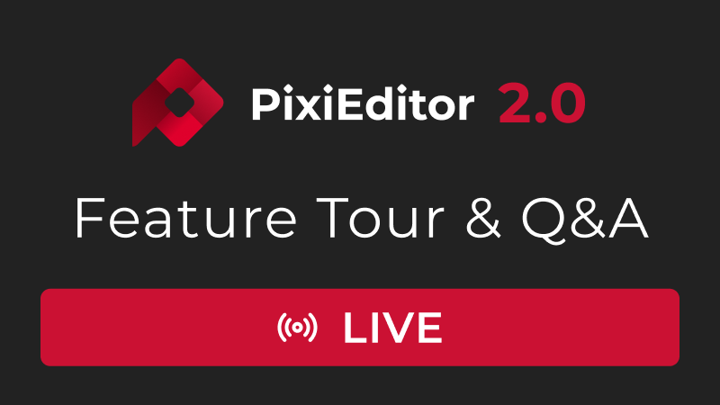
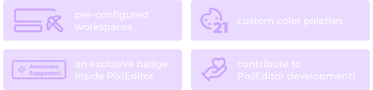
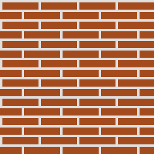
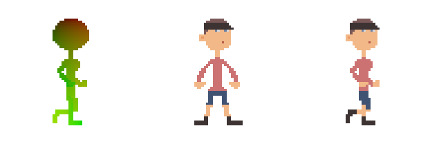
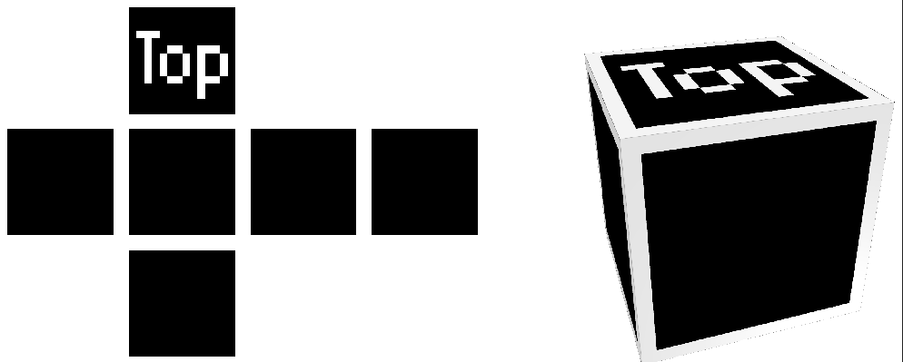
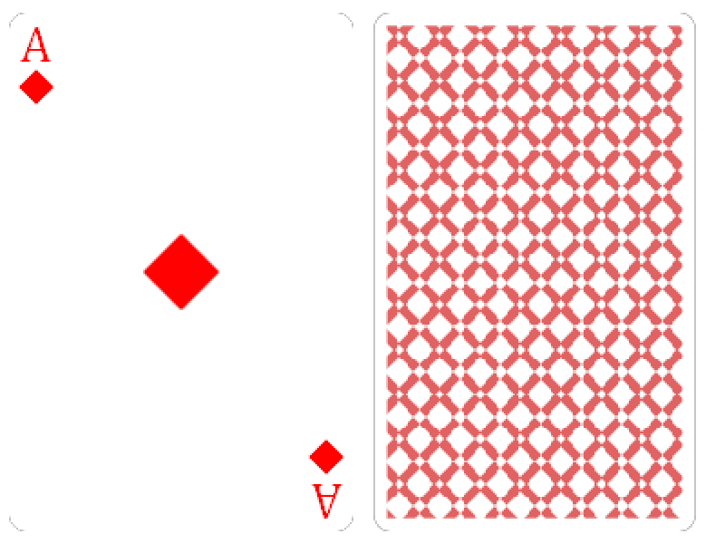
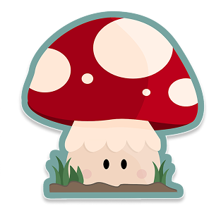

import Cover from "./assets/v2-release-date/cover.png";
import MushyPixel from "./assets/v2-release-date/mushy-pixel.png"
import { Image } from 'astro:assets';

The wait is over, long anticipated PixiEditor 2.0 releases 30th of July.

<Image src={Cover} alt="" />

{/* truncate */}

## I am supper happy to announce **PixiEditor 2.0 Release Date**

**30.07.2025**

After a long year, we are finally happy to share PixiEditor 2.0 with all of you.

If you don't know what PixiEditor 2.0 is capable of, check out [Feature Showcase](/blog/2025/03/19/q1-status)

## Release Livestream | Q&A + Feature Tour

Join us on the release day, we'll be showcasing PixiEditor 2.0 and answering all of your questions!

You will be able to watch it here 

## Announcing Founder's Pack

Along with PixiEditor 2.0, we'll be also releasing **Founder's Pack**

It's a successor of Supporter Pack, everyone who bought Supporter Pack will receive all new perks as an update. 

## What's in there? 

Updated 21 palettes, badge and **4 dedicated workspaces**

## Workspaces

### Texturing - Easily create seamless textures

### Procedural Animation - From automatic UV gradient generation, to swappable skins - ideal for pixel-art

### Voxel Texturing - Create cube textures with live **3D** preview

### Card builder - Compose your own deck of cards 

Configure pattern, rank, suits and portrait. Flipping animation included

## Meet Mushy

Mushy is our new PixiEditor buddy

Say hello to the little fella!

He changes styles, you might find him a little more pixelated

<Image src={MushyPixel} class="w-[300px]" style={{imageRendering: "pixelated"}} alt="" />

or sketched

